```r
#Load Data
#(After slightly cleaning column titles - in future include code to do that here)

rm(list=ls())
library(tidyverse)
library(ggplot2)
path <- "C:/Users/k1076631/Google Drive/Research/Papers/InProgress/ialeUK_25years/QuantAnalysis/Rproject"
setwd(path)
filename <- "abstract_review_export_2018-06-11.csv"
cpdata <- read_csv(filename)
```

This document contains analysis by year. Future analysis could examine contribution attributes by:

- author affiliation (e.g. do NGOs conduct studies are particular scales?)
- landscape type (e.g. what species do studies in Urban landscapes focus on?) 
- species (e.g. are birds studied more using empirical studies or GIS?) 

etc.


```r
#spec(cpdata)

yrdata <- cpdata %>%
  select_if(is.numeric) %>%
  group_by(`Conference Year`) %>%
  summarise_all(sum, na.rm=T) 
```


```r
#spec(cpdata)

affildata <- yrdata %>%
   mutate(yrsum = rowSums(.[2:6])) %>%   #calculate total for subsquent calcultation of proportion
  gather(key = Affiliation, value = count, Academic:Private) %>%
  mutate(prop = count / yrsum)  %>% #calculate proportion
  group_by(`Affiliation`) %>%
  summarise_all(sum, na.rm=T) 

#lspAffil <- affildata %>%
#  select(Affiliation,`Upland rural`, `Lowland rural`, Urban,	Riverscape, Seascape, `Undefined LspType`,Other) #%>%
  #mutate(yrsum = rowSums(.[2:8])) %>%
  #gather(key = Type, value = count, -Affiliation, -yrsum) %>%
  #mutate(prop = count / yrsum) 

#ggplot(lspAffil, aes(x=Affiliation, y=prop, fill=Type)) + geom_bar(stat="identity", colour="white") + scale_y_continuous(labels=percent_format())
```


**Total Conference Contributions**

Quick observations:

- general increase through time to early 2000s then drop but steady through 2010s

```r
authorCounts <- yrdata %>%
  select(`Conference Year`,Academic, Government,NGO,Business,Private) %>%
  mutate(yrsum = rowSums(.[2:6])) %>%   #calculate total for subsquent calcultation of proportion
  gather(key = Type, value = count, -`Conference Year`, -yrsum) %>%
  mutate(prop = count / yrsum)  #calculate proportion

ggplot(authorCounts, aes(x=`Conference Year`, y=count)) + geom_bar(stat="identity")
```

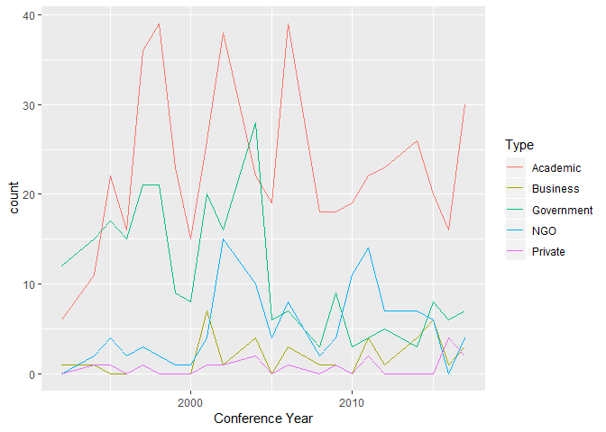<!-- -->


Stacked bar plots of contributions (by types and year)

**Author Affiliation**

Quick observations:

- Academic contributors generally dominate
- Government contributors have decreased through time
- NGO attendance has replaced declines in Government? (could check sum of Gov + NGO through time)


```r
authorCounts <- yrdata %>%
  select(`Conference Year`,Academic, Government,NGO,Business,Private) %>%
  mutate(yrsum = rowSums(.[2:6])) %>%   #calculate total for subsquent calcultation of proportion
  gather(key = Type, value = count, -`Conference Year`, -yrsum) %>%
  mutate(prop = count / yrsum)  #calculate proportion


ggplot(authorCounts, aes(x=`Conference Year`, y=count)) + geom_line(aes(colour=Type))
```

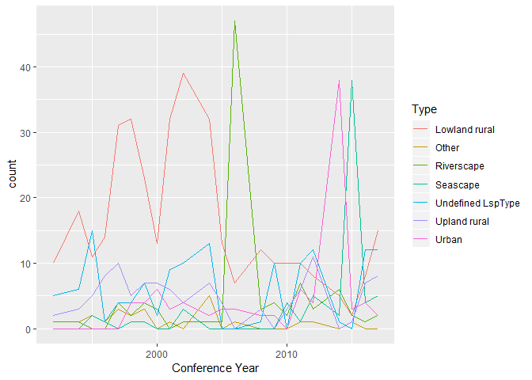<!-- -->

```r
ggplot(authorCounts, aes(x=`Conference Year`, y=count, fill=Type)) + geom_bar(stat="identity", colour="white")
```

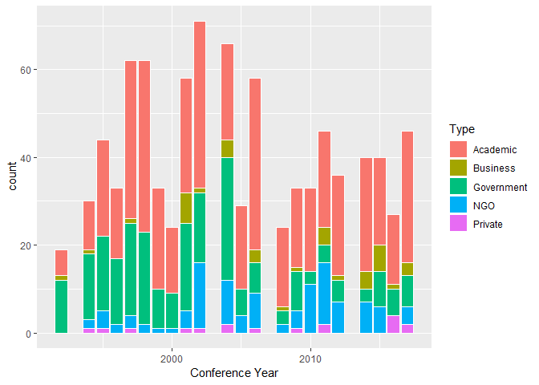<!-- -->

```r
ggplot(authorCounts, aes(x=`Conference Year`, y=prop, fill=Type)) + geom_bar(stat="identity", colour="white")
```

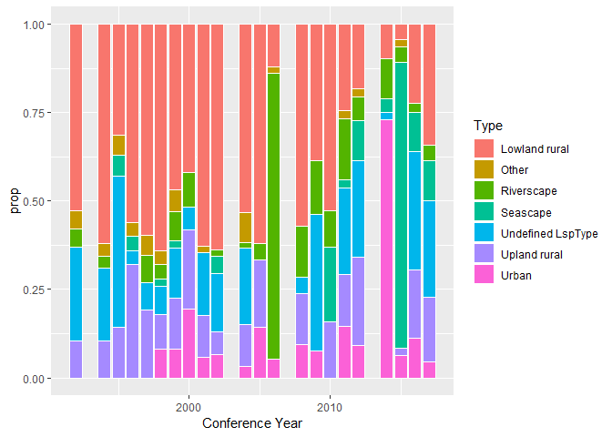<!-- -->

**Landscape Type**

Quick observations:

- Lowland rural generaly dominates (but lesser contribution in later years)
- Spikes in some years for types (corresponding to special themes)
- Urban and Seascape both appear for first time in 1998; urban then constant presence, but seascape more variable until recent years 

```r
lspCounts <- yrdata %>%
  select(`Conference Year`,`Upland rural`, `Lowland rural`, Urban,	Riverscape, Seascape, `Undefined LspType`,Other) %>%
  mutate(yrsum = rowSums(.[2:8])) %>%
  gather(key = Type, value = count, -`Conference Year`, -yrsum) %>%
  mutate(prop = count / yrsum) 


ggplot(lspCounts, aes(x=`Conference Year`, y=count)) + geom_line(aes(colour=Type))
```

<!-- -->

```r
ggplot(lspCounts, aes(x=`Conference Year`, y=count, fill=Type)) + geom_bar(stat="identity", colour="white")
```

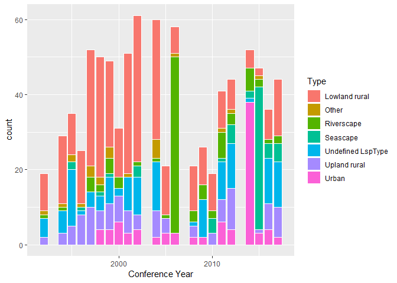<!-- -->

```r
ggplot(lspCounts, aes(x=`Conference Year`, y=prop, fill=Type)) + geom_bar(stat="identity", colour="white")
```

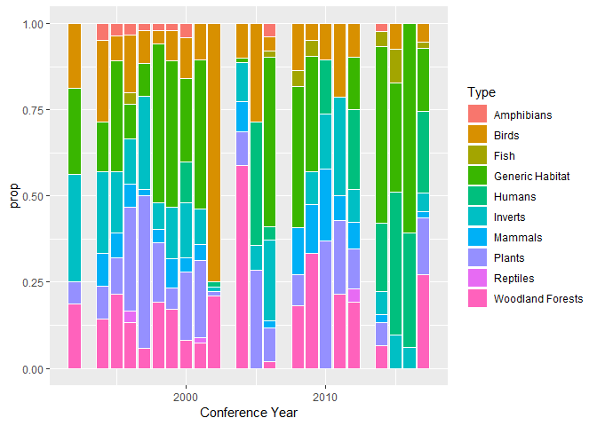<!-- -->

**Species**

Quick observations:

- no clear patterns
- some years contain no Generic Habitat - is this real or a data entry issue?

```r
sppCounts <- yrdata %>%
  select(`Conference Year`,Mammals, Humans, Birds, Reptiles, Inverts, Plants, Amphibians, Fish, `Generic Habitat`,`Woodland Forests`) %>%
  mutate(yrsum = rowSums(.[2:11])) %>%
  gather(key = Type, value = count, -`Conference Year`, -yrsum) %>%
  mutate(prop = count / yrsum) 

ggplot(sppCounts, aes(x=`Conference Year`, y=count)) + geom_line(aes(colour=Type))
```

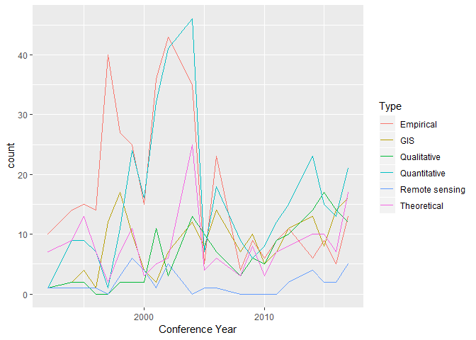<!-- -->

```r
ggplot(sppCounts, aes(x=`Conference Year`, y=count, fill=Type)) + geom_bar(stat="identity", colour="white")
```

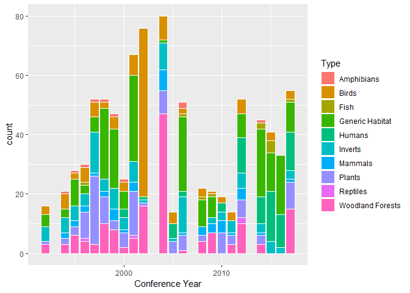<!-- -->

```r
ggplot(sppCounts, aes(x=`Conference Year`, y=prop, fill=Type)) + geom_bar(stat="identity", colour="white")
```

<!-- -->

**Methods**

Quick observations:

- empirical studies have decreased through time
- GIS and qualitative have increased through time
- Quantitative and theoretical quite steady through time (although theoretical does seem to have reduced after initial years)

```r
methodsCounts <- yrdata %>%
  select(`Conference Year`, Empirical, Theoretical, Qualitative, Quantitative, GIS, `Remote sensing`) %>%
  mutate(yrsum = rowSums(.[2:7])) %>%
  gather(key = Type, value = count, -`Conference Year`, -yrsum) %>%
  mutate(prop = count / yrsum) 

ggplot(methodsCounts, aes(x=`Conference Year`, y=count)) + geom_line(aes(colour=Type))
```

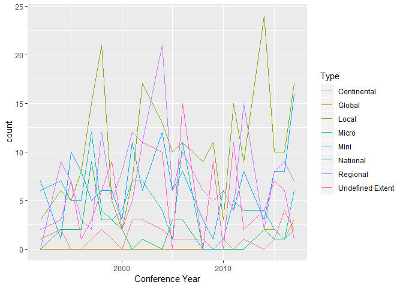<!-- -->

```r
ggplot(methodsCounts, aes(x=`Conference Year`, y=count, fill=Type)) + geom_bar(stat="identity", colour="white")
```

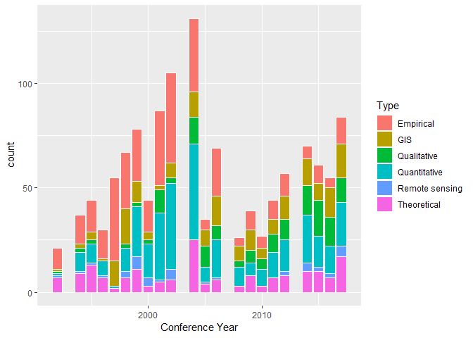<!-- -->

```r
ggplot(methodsCounts, aes(x=`Conference Year`, y=prop, fill=Type)) + geom_bar(stat="identity", colour="white")
```

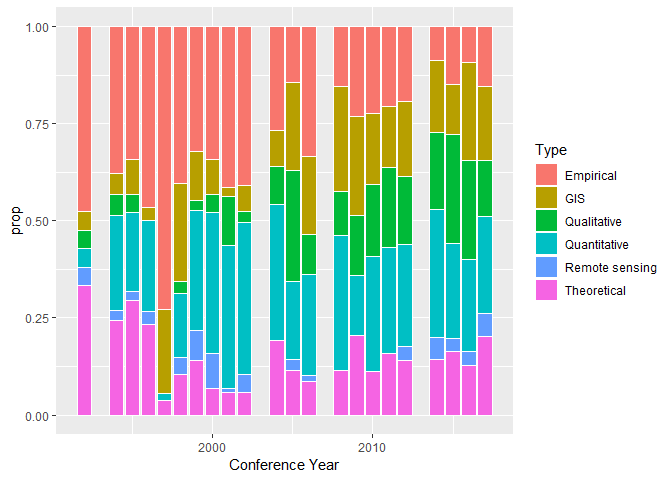<!-- -->

**Spatial Extent**

Quick observations:

- no clear trends?
- Global studies only appear from 2014 onwards

```r
extentCounts <- yrdata %>%
  select(`Conference Year`, Micro, Mini, Local, Regional, National, Continental, Global,`Undefined Extent`) %>%
  mutate(yrsum = rowSums(.[2:9])) %>%
  gather(key = Type, value = count, -`Conference Year`, -yrsum) %>%
  mutate(prop = count / yrsum) 

ggplot(extentCounts, aes(x=`Conference Year`, y=count)) + geom_line(aes(colour=Type))
```

<!-- -->

```r
ggplot(extentCounts, aes(x=`Conference Year`, y=count, fill=Type)) + geom_bar(stat="identity", colour="white")
```

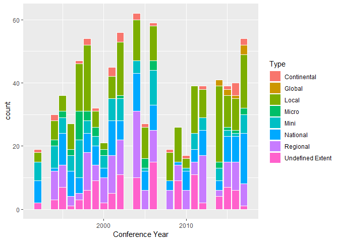<!-- -->

```r
ggplot(extentCounts, aes(x=`Conference Year`, y=prop, fill=Type)) + geom_bar(stat="identity", colour="white")
```

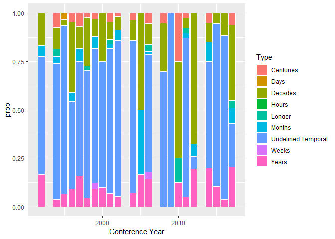<!-- -->


**Temporal Extent**

Quick observations:

- most studies have undefined temporal duration
- those that do are dominated by studies over decades and years 
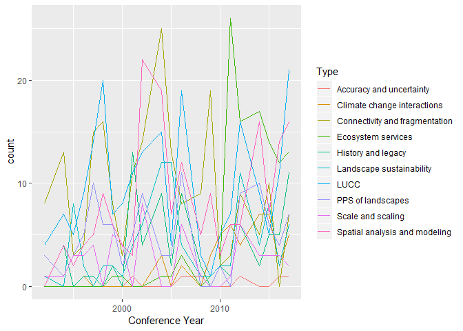<!-- -->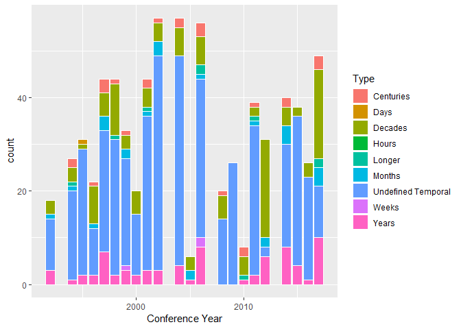<!-- -->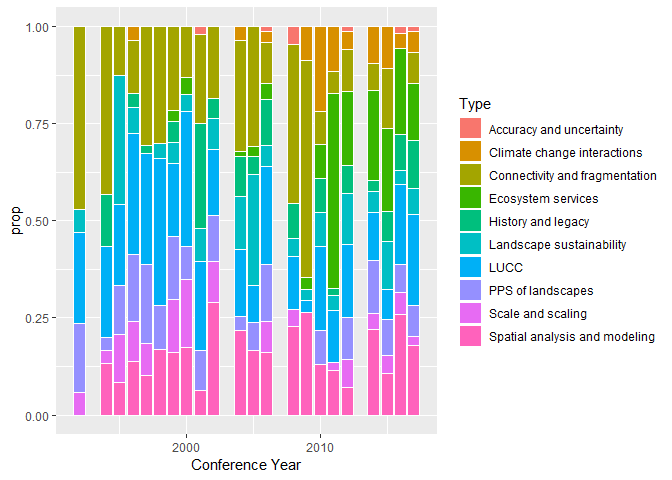<!-- -->

**Concepts**

Quick observations:

- Ecosystem services appear from 1998 and have grown recently
- climate change interactions have only become common recently (since 2008)
- 'Scale and scaling' and 'connectivity and fragmentation seem to have decreased oin recent years
- LUCC and Spatial Analysis are mainstays throughout

```r
conceptCounts <- yrdata %>%
  select(`Conference Year`, `PPS of landscapes`,
`Connectivity and fragmentation`, `Scale and scaling`,`Spatial analysis and modeling`,LUCC,`History and legacy`,`Climate change interactions`,`Ecosystem services`,`Landscape sustainability`,`Accuracy and uncertainty`
) %>%
  mutate(yrsum = rowSums(.[2:11])) %>%
  gather(key = Type, value = count, -`Conference Year`, -yrsum) %>%
  mutate(prop = count / yrsum) 

ggplot(conceptCounts, aes(x=`Conference Year`, y=count)) + geom_line(aes(colour=Type))
```

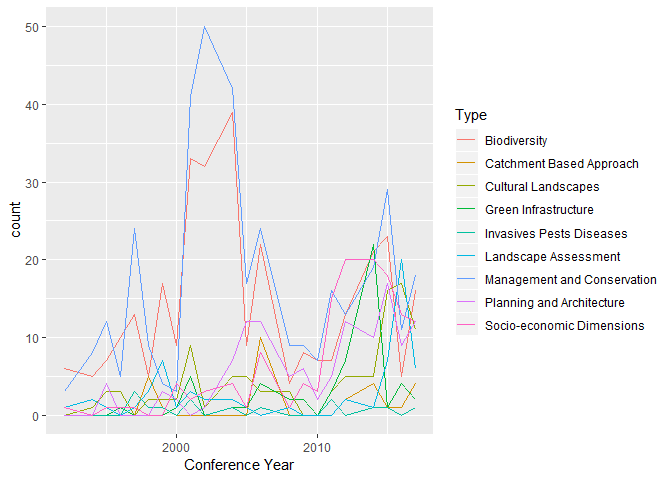<!-- -->

```r
ggplot(conceptCounts, aes(x=`Conference Year`, y=count, fill=Type)) + geom_bar(stat="identity", colour="white")
```

<!-- -->

```r
ggplot(conceptCounts, aes(x=`Conference Year`, y=prop, fill=Type)) + geom_bar(stat="identity", colour="white")
```

<!-- -->

**Concepts**

Quick observations:

- socio-economic studies have increased through time
- biodiversity has decreased through time
- Landscape management and Biodiversity peak in early 2000s

```r
othCCounts <- yrdata %>%
  select(`Conference Year`, `Green Infrastructure`,`Planning and Architecture`,`Management and Conservation`,`Cultural Landscapes`,`Socio-economic Dimensions`,Biodiversity,`Landscape Assessment`,`Catchment Based Approach`,`Invasives Pests Diseases`
) %>%
  mutate(yrsum = rowSums(.[2:10])) %>%
  gather(key = Type, value = count, -`Conference Year`, -yrsum) %>%
  mutate(prop = count / yrsum) 

ggplot(othCCounts, aes(x=`Conference Year`, y=count)) + geom_line(aes(colour=Type))
```

<!-- -->

```r
ggplot(othCCounts, aes(x=`Conference Year`, y=count, fill=Type)) + geom_bar(stat="identity", colour="white")
```

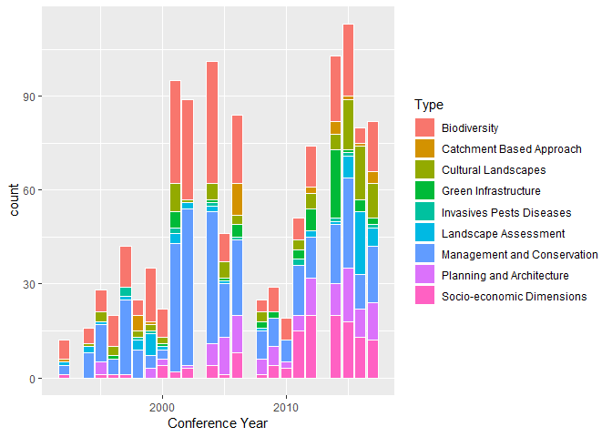<!-- -->

```r
ggplot(othCCounts, aes(x=`Conference Year`, y=prop, fill=Type)) + geom_bar(stat="identity", colour="white")
```

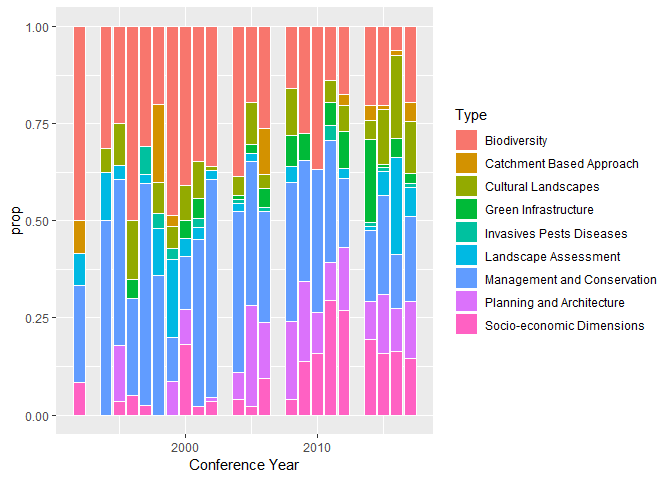<!-- -->
